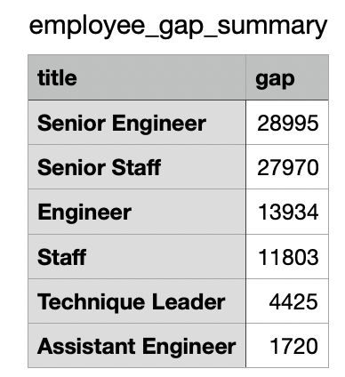

# Pewlett-Hackard_Analysis

## Overview
As Pewlett-Hackard prepares for their future, the reality of retirements is becoming a significant concern. An analysis needs to be done to determine the business impacts of employees retiring.

* Identify the departments at the highest risk.
* Determine how many employees are retirement eligible.
* Identify employees to be mentored by more tenured employees to ensure knowledge transfer.
* Identify gaps where accelerated training needs to take place.

## Results

Pewlett-Hackard's total employee count is 300,024. However, it is not enough to overcome employees retiring. 
  
    

* As it stands today,  **30%** of Pewlett-Hackard's employees are retirement eligible based upon employees born between January 1952 through month end December 1955.

   

* Employees born in 1965 have been identified as the ideal group for mentoring/knowledge transfer. This group represents **0.05%** of the employee population, creating a potential **29.5%** shortfall.
      
   
      
* Senior level jobs (Senior Engineer and Senior Staff) make up **64%** of the entire retirement eligible group.
      
       
      
* For the potential mentees, these same two senior level jobs (Senior Engineer and Senior Staff) make up **45%** of the entire mentee eligible group.

      
        
## Summary

As stated above, the current count of retirement eligible employees is **90,398**. Pewlett-Hackard will need to hire 88,847 employees to fill the gap should all retirement eligible employees as they decide to retire. The current profile for those employees is provided here:
        
     
                
While some current employees have been identified as suitable mentees, the gap remains significant. The follow table demonstrates remaining needs for each job title function:
        
   
        
## Recommendations
1. It will be prudent to continue to reach into the employee population and identify additional mentees, based on skill set and not birth year. 
2. A hiring task force could be formed to launch a hiring campaign and provide a pipeline for the company.
3. An incentive plan for retirement eligible employees to mentor others could offset a massive exit and impact to the business.
